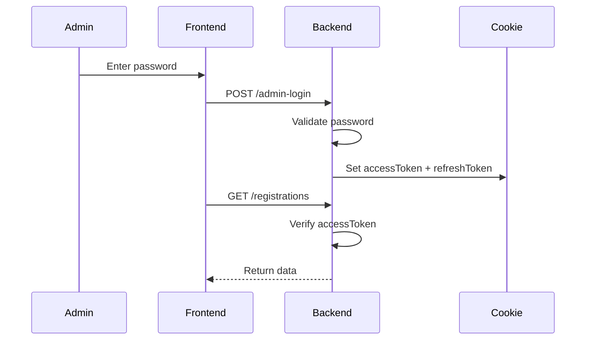

# 🎟️ Event Registration Website

A secure, full-stack event registration platform built with React, TailwindCSS, Firebase, and Express. It features JWT-based admin authentication, cookie-based session management, refresh token rotation, and a polished UX for both users and admins.

---

## 🚀 Tech Stack

| Layer        | Technology                            |
|--------------|----------------------------------------|
| Frontend     | React, Vite, TailwindCSS               |
| Backend      | Node.js, Express, JWT, dotenv          |
| Database     | Firestore (via Firebase SDK)           |
| Auth         | JWT (access + refresh tokens), cookies |
| Validation   | express-validator                      |
| Security     | Helmet, Rate Limiting, CORS            |
| Deployment   | GitHub (local dev), Firebase-ready     |

---

## 📁 Folder Structure

```
EVENT-REGISTRATION-WEBSITE/
├── backend/
│   ├── server.js
│   ├── .env
│   ├── registrations.json
│   ├── backup-*.json
│   ├── package.json
│   └── .gitignore
├── frontend/
│   ├── src/
│   │   ├── components/
│   │   │   ├── Navbar.jsx
│   │   │   ├── RegistrationForm.jsx
│   │   │   ├── RegistrationsTable.jsx
│   │   │   └── UserList.jsx
│   │   ├── pages/
│   │   │   ├── Home.jsx
│   │   │   ├── AdminLogin.jsx
│   │   │   ├── AdminDashboard.jsx
│   │   │   └── Registrations.jsx
│   │   ├── firebase.js
│   │   ├── auth.js
│   │   ├── App.jsx
│   │   ├── main.jsx
│   │   └── index.css
│   ├── tailwind.config.js
│   ├── postcss.config.js
│   ├── vite.config.js
│   └── .gitignore
└── README.md

```

---

## 🔐 Concepts Used & Why

| Concept                     | Why We Used It                                                                 | Alternatives & Why Not Chosen                          |
|----------------------------|----------------------------------------------------------------------------------|--------------------------------------------------------|
| JWT (access + refresh)     | Stateless, scalable auth with token expiry & refresh                            | Sessions: harder to scale, less control over expiry    |
| Cookie-based storage       | Secure, HttpOnly cookies for storing tokens                                     | LocalStorage: vulnerable to XSS                        |
| Express-validator          | Clean input validation with detailed error reporting                            | Manual validation: error-prone                         |
| Rate Limiting              | Prevent abuse of registration endpoint                                          | None: would allow spam                                 |
| Helmet                     | Sets secure HTTP headers                                                        | Manual headers: less coverage                          |
| Firebase SDK (frontend)    | Handles Firestore access with built-in CORS support                             | REST API: blocked by browser CORS                      |
| dotenv                     | Keeps secrets out of codebase                                                   | Hardcoded secrets: flagged by GitHub                   |

---

## 📊 Architecture Diagram

```mermaid

graph TD
    subgraph User Registration Flow
        A[User] -->|"Submits Registration"| B[Frontend (React)];
        B -->|"POST /register"| C[Backend (Express)];
        C -->|"Validate & Save"| D[registrations.json];
    end

    subgraph Admin Flow
        A2[Admin User] -->|"Logs In"| B;
        B -->|"POST /admin-login"| C;
        C -->|"Issues JWT + Refresh Token"| E[Cookies];
        B -->|"GET /registrations (with JWT)"| C;
        C -->|"1. Verify JWT"| C;
        C -->|"2. Read Data"| D;
    end

    subgraph Firebase Data Fetching
        B -->|"GET Firestore Data"| F[Firebase SDK];
        F --> G[Firestore Database];
    end

```
---

## 🔁 Flowchart: Admin Authentication


---

## 🧪 Terminal Commands Used

# 🔧 Setup

```
npm install          # install dependencies (frontend/backend)
npm install -D tailwindcss postcss autoprefixer @tailwindcss/postcss
npm install firebase
npm install jsonwebtoken express-validator cookie-parser helmet cors dotenv

```

# 🏃 Run Dev Servers

```
npx nodemon server.js        # backend
npm run dev                  # frontend

```

# 🔐 Git & GitHub

```
git init
git add .
git commit -m "Initial commit: setup frontend (React + Tailwind + Firebase) and backend (Express + JWT + cookies)"
git remote add origin https://github.com/mdnm18/event-registration-website.git
git push -u origin main

```
---

## ✅ Features

•  Public user registration with validation
•  Admin login with JWT + refresh token
•  Cookie-based session management
•  Auto logout on token expiry
•  Admin dashboard to view/delete registrations
•  Firestore integration for dynamic data
•  Tailwind-powered responsive UI
•  Rate limiting to prevent abuse
•  Backup JSON snapshots on server start

---

## 📌 To Do / Future Enhancements

•  Migrate refresh token store to MongoDB
•  Add email confirmation for registrations
•  Deploy to Firebase Hosting + Cloud Functions
•  Add role-based access control
•  Integrate analytics dashboard

---

## 📄 License

This project is licensed under the MIT License.

---

## 🙌 Author

MD Nayaj Mondal  
Full-stack developer passionate about secure, scalable web applications.
